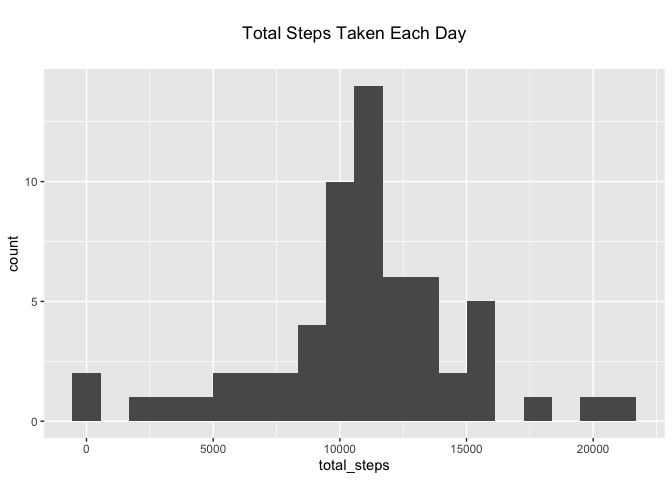
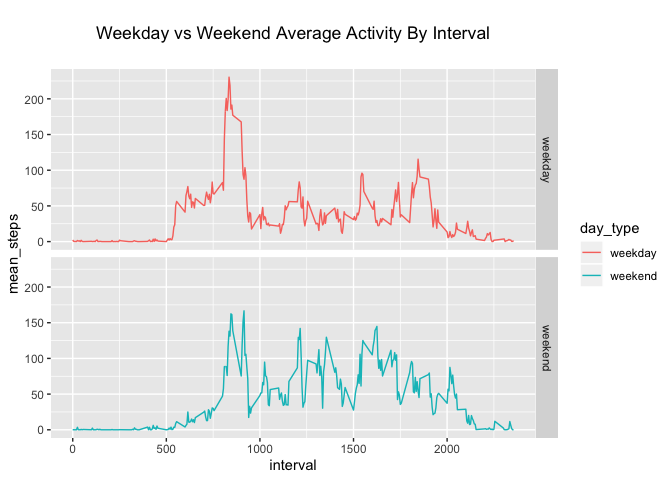

---
title: |
  | Reproducible Research: 
  | Activity Data Report and Analysis
author: "Justin Abbott"
date: |
  | 2019-12-21
  | \n
output: 
  html_document:
    keep_md: true
    
--- 

Introduction from Coursera Assignment page:

"It is now possible to collect a large amount of data about personal movement using activity monitoring devices such as a Fitbit, Nike Fuelband, or Jawbone Up. These type of devices are part of the “quantified self” movement – a group of enthusiasts who take measurements about themselves regularly to improve their health, to find patterns in their behavior, or because they are tech geeks. But these data remain under-utilized both because the raw data are hard to obtain and there is a lack of statistical methods and software for processing and interpreting the data.

This assignment makes use of data from a personal activity monitoring device. This device collects data at 5 minute intervals through-out the day. The data consists of two months of data from an anonymous individual collected during the months of October and November, 2012 and include the number of steps taken in 5 minute intervals each day."

## Loading and preprocessing the data

First, we're going to load the data and take a look and see if we need to do
any preprocessing. The bulk of our processes in this analysis will be using the dplyr and ggplot2 packages.


```r
library(tidyverse)

activity <- read.csv(unz("activity.zip", "activity.csv"), header = TRUE)
head(activity)
##   steps       date interval
## 1    NA 2012-10-01        0
## 2    NA 2012-10-01        5
## 3    NA 2012-10-01       10
## 4    NA 2012-10-01       15
## 5    NA 2012-10-01       20
## 6    NA 2012-10-01       25

str(activity)
## 'data.frame':	17568 obs. of  3 variables:
##  $ steps   : int  NA NA NA NA NA NA NA NA NA NA ...
##  $ date    : Factor w/ 61 levels "2012-10-01","2012-10-02",..: 1 1 1 1 1 1 1 1 1 1 ...
##  $ interval: int  0 5 10 15 20 25 30 35 40 45 ...
```
  
  
Just checking the initial values in the imported dataframe we see there are
missing values. Checking the structure of the activity data we see that the date
is coming in as a factor variable. Let's change that to a Date class variable to
more accurately represent it.


```r
activity$date <- as.Date(as.character(activity$date))
str(activity)
## 'data.frame':	17568 obs. of  3 variables:
##  $ steps   : int  NA NA NA NA NA NA NA NA NA NA ...
##  $ date    : Date, format: "2012-10-01" "2012-10-01" ...
##  $ interval: int  0 5 10 15 20 25 30 35 40 45 ...
```
  
  
  
## What is mean total number of steps taken per day?

Ignoring the missing values for now, lets create a dataframe aggragating the the total number of steps taken per day


```r
total_steps <- activity %>%
    group_by(date) %>%
    summarize(steps = sum(steps, na.rm = T))

head(total_steps)
## # A tibble: 6 x 2
##   date       steps
##   <date>     <int>
## 1 2012-10-01     0
## 2 2012-10-02   126
## 3 2012-10-03 11352
## 4 2012-10-04 12116
## 5 2012-10-05 13294
## 6 2012-10-06 15420
```
  
  
Now lets take a look at a histogram created from this dataframe. Using a histogram we are able to see the shape of the data


```r
ggplot(total_steps, aes(steps)) +
    geom_histogram(bins = 20) +
    labs(title = "\n Total Steps Taken Each Day \n") +
    theme(plot.title = element_text(hjust = 0.5))
```

<!-- -->

The histogram allows us to see there is an outlier that is drastically different from the rest of the values. This large amount of zero values can be explained by the missing values in the dataset that we noticed previously. Looking at the rest of the plot, we can see that the data is mostly normally distributed, and most of the days have around 10,000 steps or more recorded.


```r
(mean_steps <- mean(total_steps$steps))
## [1] 9354.23
(median_steps <- median(total_steps$steps))
## [1] 10395
```

The mean number of total steps over the 61 days period is  9354.2295082  and the respective median is  10395. We can see that the outliers are lowering the mean of the dataset.
  
  
  
## What is the average daily activity pattern?

Next, let's make a time series plot of the 5-minute intervals and the average number of steps taken, averaged across all days. This will help us determine which parts of the day have more activity than others.


```r
interval_steps <- activity %>%
    group_by(interval) %>%
    summarize(mean_steps = mean(steps, na.rm = T))

ggplot(interval_steps,aes(interval, mean_steps)) +
    geom_line(color = "red") +
    labs(title = "\n Average Activity Per Interval \n") +
    theme(plot.title = element_text(hjust = 0.5))
```

<!-- -->

Here we see that at approximately 8:00 AM, we have the largest amount of steps taken in the day on average. 

Using the code below, we can find out which 5-minute interval, on average across all the days in the dataset, contains the maximum number of steps:


```r
max_steps <- activity %>%
  group_by(interval) %>%
  summarize(sum_steps = sum(steps, na.rm = T)) %>%
  arrange(desc(sum_steps))

head(max_steps, 1)
## # A tibble: 1 x 2
##   interval sum_steps
##      <int>     <int>
## 1      835     10927
```

Here we see that the 5-min interval that has the highest amount of steps recorded over the two month period is 8:35-8:40 AM.
  
  
  
## Imputing missing values
  
  
Now that we have taken this initial look at the data, lets do something about the missing values.


```r
(total_missing <- sum(is.na(activity$steps)) / nrow(activity))
## [1] 0.1311475
```

Running the code above it seems that we have about 13% of our step values missing. This large amount is introducing a bias into our data that we have already seen through our analysis.

One way of imputing the data missing is to replace every missing value with the mean number of steps for that 5-min interval. That is a realistic and reasonable predicted value for the steps that would have been taken.


```r
impute_data <- activity %>%
    mutate(steps = ifelse(is.na(steps),
                   interval_steps$mean_steps[interval_steps$interval %in% interval],
                   steps))
```

Now checking out the first few values of the data which were previously NA, we see that they are replaced


```r
head(impute_data)
##       steps       date interval
## 1 1.7169811 2012-10-01        0
## 2 0.3396226 2012-10-01        5
## 3 0.1320755 2012-10-01       10
## 4 0.1509434 2012-10-01       15
## 5 0.0754717 2012-10-01       20
## 6 2.0943396 2012-10-01       25
```
  
  
Lets also take a broader look at the data with a histogram similar to the one we previously used and observe the effect that missing values can have on a dataset.


```r
plot_data <- impute_data %>%
    group_by(date) %>%
    summarize(total_steps = sum(steps, na.rm = T))
  
ggplot(plot_data, aes(total_steps)) +
    geom_histogram(bins = 20) +
    labs(title = "\n Total Steps Taken Each Day \n") +
    theme(plot.title = element_text(hjust = 0.5))
```

<!-- -->

Here we see the shape of the previous plot has been preserved and there is less bias towards zero values.


```r
mean_imp_data <- round(mean(plot_data$total_steps), 2)
median_imp_data <- round(median(plot_data$total_steps), 2)
```

After imputing the missing values, the mean number of total steps over the 61 days period is  1.076619\times 10^{4}  and the respective median is  1.076619\times 10^{4}. The mean and the median is the same! We can also see that filling in the missing values raised our calulated mean number of daily steps above 10,000.
  
  
  
## Are there differences in activity patterns between weekdays and weekends?


```r
weekday_list <- c("Monday", "Tuesday", "Wednesday", "Thursday", "Friday")

day_diff <- impute_data %>%
    mutate(day_type = if_else(weekdays(date) %in% weekday_list,
                              "weekday",
                              "weekend")) %>%
    group_by(day_type, interval) %>%
    summarize(mean_steps = mean(steps))

ggplot(day_diff, aes(interval, mean_steps, color = day_type)) +
    geom_line() +
    labs(title = "\n Weekday vs Weekend Average Activity By Interval \n") +
    theme(plot.title = element_text(hjust = 0.5))
```

<!-- -->
  
    
By categorizing the days into weekend/weekday values and grouping the data by this new field, we can observe impact it has on the average steps recorded by the group.
